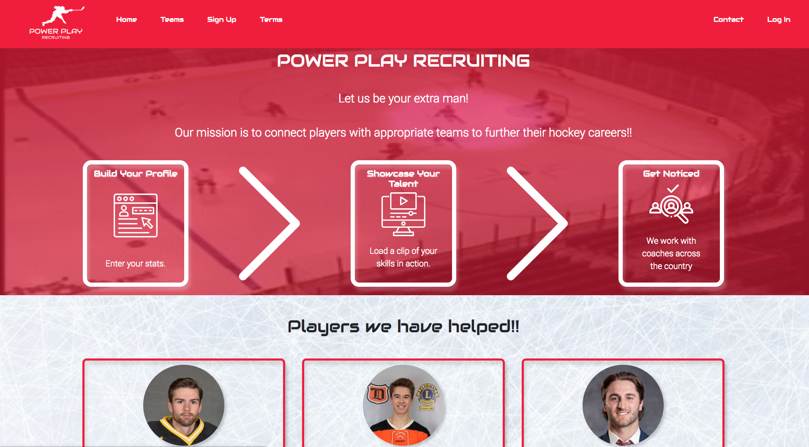
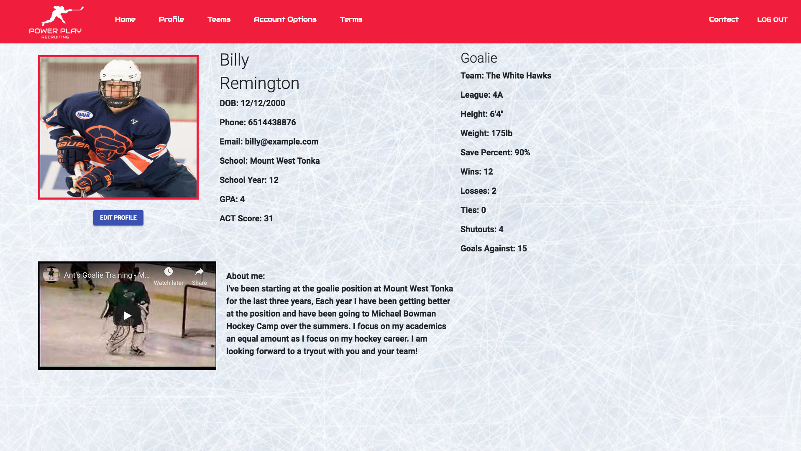
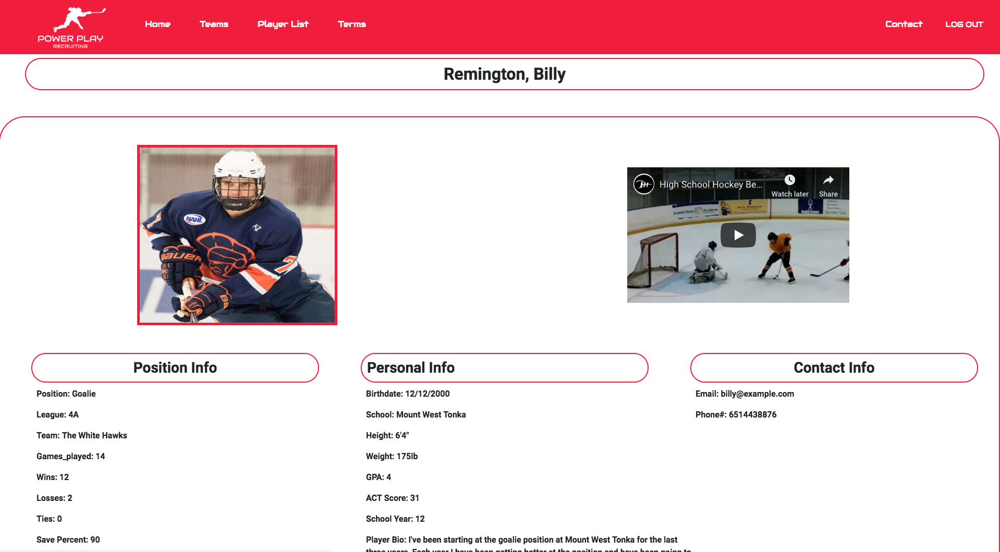
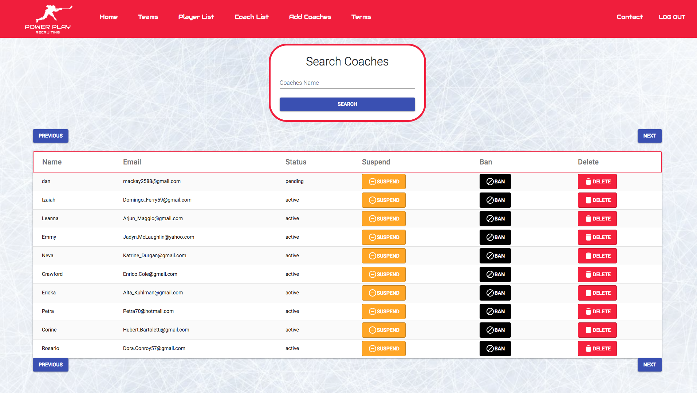

# Power Play Recruiting
This project is a website and system for parents of youth hockey players and young adult hockey players under the age of 21 to showcase themselves to schools, coaches, and other recruiters.  Player accounts will not be able to view or initiate contact with coaches or teams and they will not be able to view other player accounts. Coaches/recruiters will be invited by the Admin user (Mike Bowman, Logan Sharp, Austin Hill). Coaches/recruiters can view active player profiles.

## Prerequisites

Before you get started, make sure you have the following software installed on your computer:

- [Node.js](https://nodejs.org/en/)
- [PostrgeSQL](https://www.postgresql.org/)
- [Nodemon](https://nodemon.io/)

## Create database and table

Download the repository.

Create a new database called `ppr_hockey` and run the SQL queries in the database.sql file

If you would like to name your database something else, you will need to change `ppr_hockey` to the name of your new database name in `server/modules/pool.js`

## Development Setup Instructions

* Run `npm install`
* Create a `.env` file at the root of the project and paste this line into the file:
    ```
    SERVER_SESSION_SECRET=**secret goes here**

    my_gmail_email = ** admin or site email goes here **

    my_oauth_client_id = ** google oauth2 client id goes here **

    my_oauth_client_secret = ** google oauth2 client secret goes here **

    my_oauth_refresh_token = ** google oauth2 refresh token goes here **

    my_oauth_access_token = ** google oauth2 access token goes here **

    set_password_page = ** url for website ending with /#/set_password/ goes here **

    set_home_page = ** url for home page of website goes here **

    REACT_APP_STRIPE_PK_KEY = ** stripe publishing key goes here **

    STRIPE_SK_KEY = ** stripe secret key goes here **
    ```
    While you're in the `.env` file, replace `**secret goes here**` with some long random string like `25POUbVtx6RKVNWszd9ERB9Bb6` to keep your application secure. Here's a site that can help you: [https://passwordsgenerator.net/](https://passwordsgenerator.net/). If you don't do this step, create a secret with less than eight characters, or leave it as `superDuperSecret`, you will get a warning.

    Replace `** google oauth2 ... goes here **' with keys from google apis oauth settings for using Node Mailer to send email invites and reset password emails. 

    Replace `** admin or site email goes here **` with email address website or admin. Email invites or reset password emails sent out will see this email address as from this sender/email address.

    Replace `** url for website ending with /#/set_password/ goes here **` with the url of the website e.g.  `https://www.pprhockey.com/#/set_password/`.

    Replace `** url for home page of website goes here **` with the url of the website
        e.g. `https://www.pprhockey.com`.

    Replace `** stripe publishing key goes here **` and `** stripe secret key goes here **` with the correct keys for the stripe api to enable payments.


* Start postgres if not running already by using `brew services start postgresql`
* Run `npm run server`
* Run `npm run client`
* Navigate to `localhost:3000`

## Screen Shots


Home page of the application with the mission statement, simple instructions, player/user testimonials and information about the founders. Navigation to sign up to be a user, log in as an existing user, view terms, or a list of teams that have coaches who use the application.


Sign Up page of the application where a user can sign up with an email and password and submit payment with a credit card via Stripe.

### Player



Player Profile page. When a player logs in they are redirected here to a profile with a placeholder pic and empty info. User can also navigate here but clicking 'Profile' in the navigation menu. The user can click the 'edit profile' button to open a dialog containg a form to add or edit their information. 

### Coach


When a Coach Logs in they are redirected here. This page is also navigated to by clicking 'Player List' in the navigation menu. The page contains a form to search and filter/sort the list of players by categories such as position, birthdate, and hockey statitics such a goals scored. The 'search' button carrys out the search. The 'download' players button downloads a csv containing the players list to the users computer. The 'previous' and 'next' buttons show the user another set of players. The 'view details' buttons in each row 
of the table open a dialog containing more information about the corresponding player.



A full page dialog showing more details about a player.



Admin view of the list of coaches. Admin can suspend delete or ban accounts. 


## Production Build

Before pushing to your hosting site, run `npm run build` in terminal. This will create a build folder that contains the code your hosting site will be pointed at. You can test this build by typing `npm start`. Keep in mind that `npm start` will let you preview the production build but will **not** auto update.

* Start postgres if not running already by using `brew services start postgresql`
* Run `npm start`
* Navigate to `localhost:5000`

## Lay of the Land

* `src/` contains the React application
* `public/` contains static assets for the client-side
* `build/` after you build the project, contains the transpiled code from `src/` and `public/` that will be viewed on the production site
* `server/` contains the Express App
